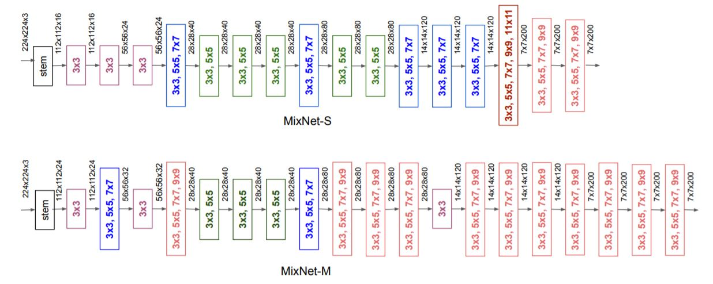
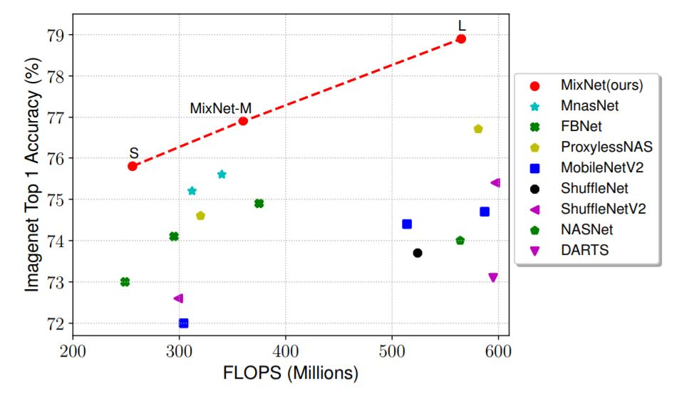

# MixNet-Pytorch
A PyTorch implementation of MixNet

# Overview
A PyTorch implementation of MixNet architecture: [MixNet: Mixed Depthwise Convolutional Kernels](https://arxiv.org/pdf/1907.09595.pdf).
Based on MobileNetV2, found by Neural Architecture Search, replacing depthwise convolution to the proposed mixed depthwise convolution (*MDConv*).
Results: More accurate than previous models including MobileNetV2 (ImageNet top-1 accuracy +4.2%), ShuffleNetV2 (+3.5%), MnasNet (+1.3%), ProxylessNAS (+2.2%), and FBNet (+2.0%).
MixNet-L achieves a new state-of-the-art 78.9% ImageNet top-1 accuracy under typical mobile settings (<600M FLOPS).

# MixNet Architecture

# MixNet Results

# Disclaimer
Slightly modified from [MobileNetV3-PyTorch](https://github.com/AnjieZheng/MobileNetV3-PyTorch) by Anjie Zheng.
